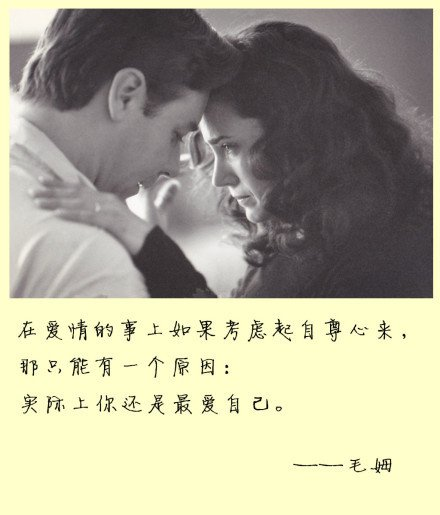
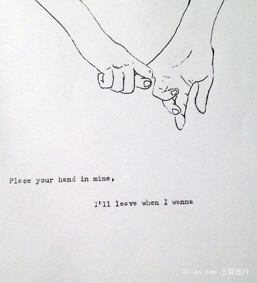

<!DOCTYPE html>
<html lang="en">
<head>
    <meta charset="UTF-8">
    <meta name="viewport" content="width=device-width, initial-scale=1.0">
    <meta http-equiv="X-UA-Compatible" content="ie=edge">
    <title>我爱零</title>
    
  
     
     
I love you.Only you.LING

  <u1></u1>
  <u2></u2>
 
     

<body>
</body>
<ml>
